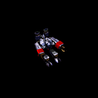
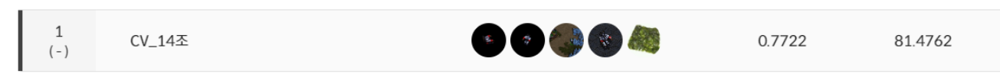

# 🦆팀소개 - CV14 SCV팀


<br/>
**`S급 CV 멤버가 5명이 모인 팀 SCV`**  


> ### 🏃‍♂️멤버
<table>
    <tr height="160px">
        <td align="center" width="150px">
            <a href="https://github.com/seungki1011"></a>
            <br/>
            <a href="https://github.com/seungki1011"><strong>김승기 </strong></a>
            <br />
        </td>
        <td align="center" width="150px">
            <a href="https://github.com/KZunT"></a>
            <br/>
            <a href="https://github.com/KZunT"><strong>김준태</strong></a>
            <br />
        </td>
        <td align="center" width="150px">
            <a href="https://github.com/Guitarboyjason"></a>
            <br/>
            <a href="https://github.com/Guitarboyjason"><strong>이태경</strong></a>
            <br />
        </td>
        <td align="center" width="150px">
            <a href="https://github.com/helpmeIamnewbie"></a>
            <br />
            <a href="https://github.com/helpmeIamnewbie"><strong>전형우</strong></a>
            <br />
        </td>
        <td align="center" width="150px">
            <a href="https://github.com/Eumgill98"></a>
            <br />
            <a href="https://github.com/Eumgill98"><strong>정호찬</strong></a>
            <br />
        </td>
    </tr>
</table>  
  
  
                
# 😷level- 1 대회 :마스크 착용 상태 분류대회

> ### 대회개요
`COVID-19의 확산으로 우리나라는 물론 전 세계 사람들은 경제적, 생산적인 활동에 많은 제약을 가지게 되었습니다. 감염자의 입, 호흡기로부터 나오는 비말, 침 등으로 전파가 되기 때문에 마스크를 착용하는 건 COIVD-19의 확산을 방지하는데 중요한 역할을 합니다. 마스크 착용 여부의 검사를 도와주기 위해 카메라로 비춰진 사람의 얼굴 이미지만으로 마스크를 쓰고 있는지, 쓰지 않았는지, 정확히 쓴 것이 맞는지 자동으로 가려낼 수 있는 모델을 제작하는 것이 프로젝트의 목적입니다`
<br/><br/><br/>
> ### 팀 목표
                
**`1. Leader Board 성능 보다는 Robust한 모델을 위한 설계를 해보자`**  
**`2. 우리가 직접 구현해보고 실험할 수 있는 것들에 시간을 투자하자`**
<br/><br/><br/>
> ### 🏃‍♂️팀 역할
|팀원|역할|
|------|---|
|김승기|EDA, Hyper Parameter, Augmentation|
|김준태|EDA, 데이터 전 처리, Modeling|
|이태경|데이터 전 처리, Augmentation, K-fold|
|전형우|EDA, Augmentation, Modeling|
|정호찬|EDA, 데이터 전 처리, Modeling |

<br/><br/>

> ### 최종결과

                
`Model weight (.pth) Link :`
<br/><br/>

> ### 모델 학습 일지 
`notion` :   
`랩업 리포트` :   
`랩업 리포트 PPT` :   
<br/><br/><br/>
                
> ### ⭐File Tree
---
```bash

  ├─main : main code
  ├─EDA.ipynb : EDA 
  ├─README.md

``` 
<br/><br/>
                
> ### 🔥필수 라이브러리 설치
---
``` bash
pip install -r requirements.txt
```
